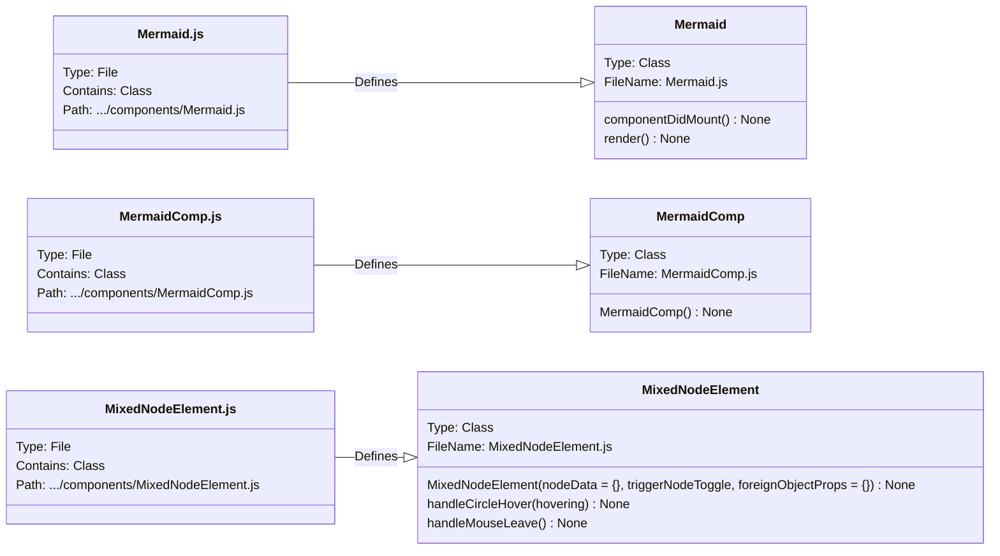

```mermaid

classDiagram

direction LR
        class `Mermaid.js` {
            Type: File
            Contains: Class
            Path: .../components/Mermaid.js
        }

        class Mermaid{
            Type: Class
            FileName: Mermaid.js
        }

        `Mermaid.js` --|> Mermaid : Defines
        
                Mermaid : componentDidMount() None
                
                Mermaid : render() None
                
        class `MermaidComp.js` {
            Type: File
            Contains: Class
            Path: .../components/MermaidComp.js
        }

        class MermaidComp{
            Type: Class
            FileName: MermaidComp.js
        }

        `MermaidComp.js` --|> MermaidComp : Defines
        
                MermaidComp : MermaidComp() None
                
        class `MixedNodeElement.js` {
            Type: File
            Contains: Class
            Path: .../components/MixedNodeElement.js
        }

        class MixedNodeElement{
            Type: Class
            FileName: MixedNodeElement.js
        }

        `MixedNodeElement.js` --|> MixedNodeElement : Defines
        
                MixedNodeElement : MixedNodeElement(nodeData = {}, triggerNodeToggle, foreignObjectProps = {}) None
                
                MixedNodeElement : handleCircleHover(hovering) None
                
                MixedNodeElement : handleMouseLeave() None
                


```